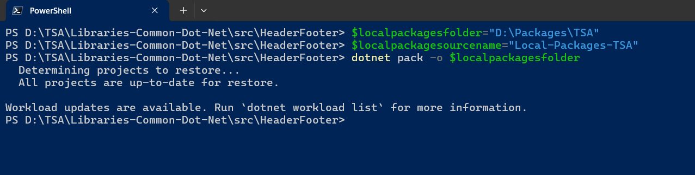
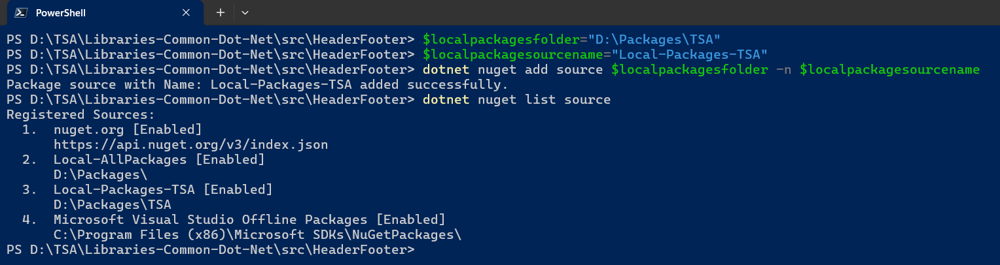

# .NET 8 and Above Common Libraries

This repository contains the .NET libraries

## 1. Create and Publish NuGet packages to Local Folder using dotnet CLI and PowerShell

### 1.1. Create required Variables using PowerShell Windows Terminal

```powershell
$localpackagesfolder="D:\Packages\TSA"
$localpackagesourcename="Local-Packages-TSA"
```

### 1.2. Publishing the packages to local folder using PowerShell Windows Terminal

> 1. Navigate to the folder where the `HeaderFooter`.csproj file is present.
> 1. In this case, it is the `D:\TSA\Libraries-Common-Dot-Net\src\HeaderFooter` folder where the `HeaderFooter`.csproj file is present.
> 1. Update the `Version`, and `AssemblyVersion` in the `HeaderFooter`.csproj file.
> 1. Run the following `dotnet` commands.

```xml
<PropertyGroup>
    <Version>1.0.1</Version>
    <AssemblyVersion>1.1</AssemblyVersion>
</PropertyGroup>
```

```powershell
dotnet clean
dotnet build
dotnet pack -o $localpackagesfolder
```



## 2. Add the Local NuGet package folder as Package Source

### 2.1. Adding local packages folder as NuGet source using PowerShell Windows Terminal

> 1. Run the following `dotnet` commands.

```powershell
dotnet nuget add source $localpackagesfolder -n $localpackagesourcename
```

### 2.2. Verify local packages folder is added as NuGet source

> 1. Run the following `dotnet` commands, to ensure that `$localpackagesourcename` is added as NuGet package source.
> 1. Run the following `dotnet nuget remove source $localpackagesourcename` command, to remove NuGet package source.

```powershell
dotnet nuget list source
```


