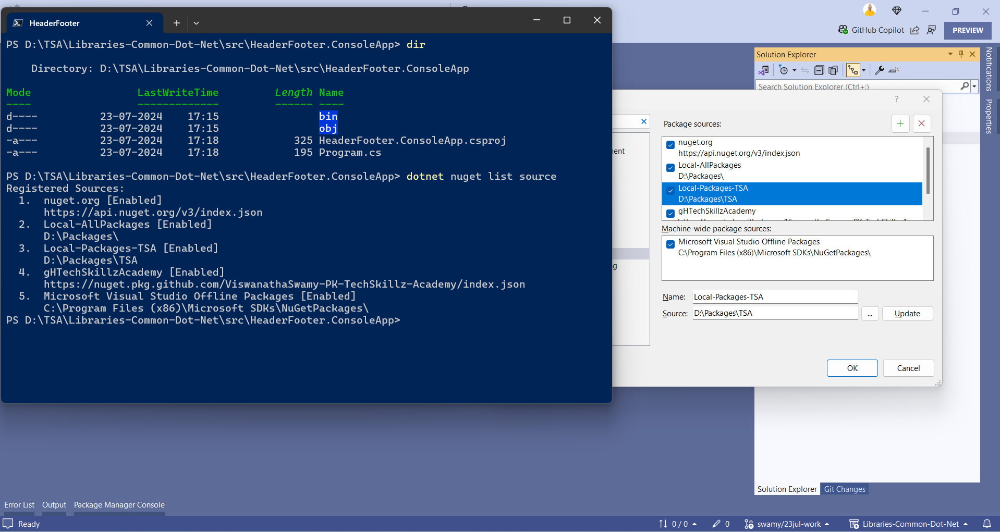
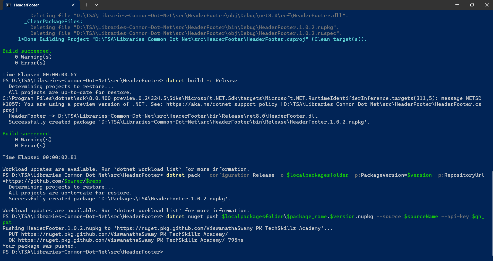
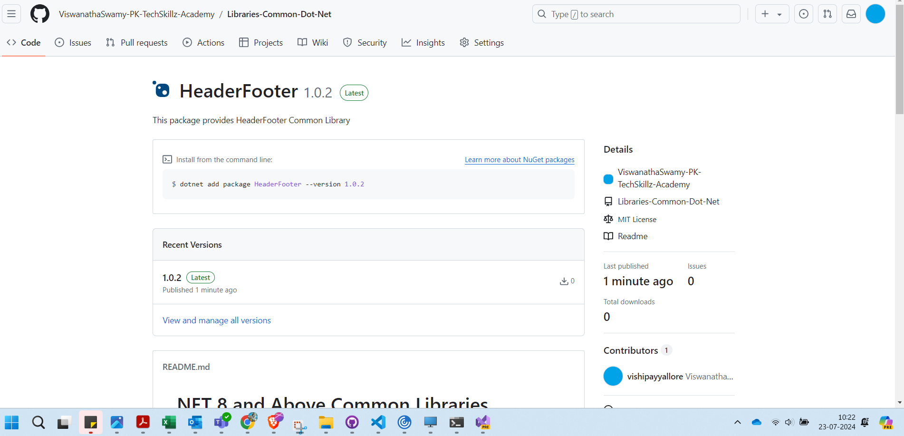
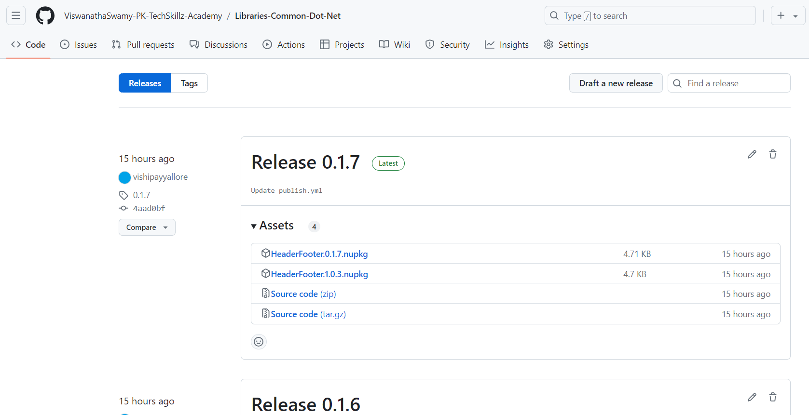

# .NET 8 and Above Common Libraries

This repository contains the .NET libraries

## 1. Create and Publish NuGet packages to Local Folder using dotnet CLI and PowerShell

### 1.1. Create required Variables using PowerShell Windows Terminal

```powershell
$localpackagesfolder="D:\Packages\TSA"
$localpackagesourcename="Local-Packages-TSA"
```

### 1.2. Publishing the packages to local folder using PowerShell Windows Terminal

> 1. Navigate to the folder where the `HeaderFooter`.csproj file is present.
> 1. In this case, it is the `D:\TSA\Libraries-Common-Dot-Net\src\HeaderFooter` folder where the `HeaderFooter`.csproj file is present.
> 1. Update the `Version`, and `AssemblyVersion` in the `HeaderFooter`.csproj file.
> 1. Run the following `dotnet` commands.

```xml
<PropertyGroup>
    <Version>1.0.3</Version>
    <AssemblyVersion>1.0.3</AssemblyVersion>
</PropertyGroup>
```

```powershell
dotnet clean
dotnet build
dotnet pack -o $localpackagesfolder
```


## 2. Add the Local NuGet package folder as Package Source

### 2.1. Adding local packages folder as NuGet source using PowerShell Windows Terminal

> 1. Run the following `dotnet` commands.

```powershell
dotnet nuget list source
dotnet nuget remove source $localpackagesourcename
dotnet nuget add source $localpackagesfolder -n $localpackagesourcename
```

### 2.2. Verify local packages folder is added as NuGet source

> 1. Run the following `dotnet` commands, to ensure that `$localpackagesourcename` is added as NuGet package source.
> 1. Run the following `dotnet nuget remove source $localpackagesourcename` command, to remove NuGet package source.

```powershell
dotnet nuget list source
```


## 3. Consuming Local NuGet package inside our application

### 3.1. Verify local packages folder is added as NuGet source

> 1. We can verify using the command line.
> 1. We can verify using VS 2022.

```powershell
dotnet nuget list source
```



### X.2. Creating required Variables using PowerShell Windows Terminal

### X.3. Creating required Variables using PowerShell Windows Terminal

## X. Create and Publish NuGet packages to GitHub Packages using dotnet CLI and PowerShell

### X.1. Creating required Variables using PowerShell Windows Terminal

To be done

### X.2. Publishing the packages to GitHub Packages using PowerShell Windows Terminal







## Publishing .NET Libraries/Packages to GitHub Packages

This guide provides detailed instructions on using the provided GitHub Actions workflow to publish .NET 8 libraries to GitHub packages.

### Workflow File: `publish.yml`

```yaml
name: Publish .NET libraries / packages

on:
  workflow_dispatch:
  push:
    branches:
      - main

permissions:
  id-token: write
  contents: read
  packages: write

defaults:
  run:
    working-directory: ./src/HeaderFooter

jobs:
  build:
    runs-on: ubuntu-latest
    outputs:
      Version: ${{ steps.gitversion.outputs.SemVer }}
      CommitsSinceVersionSource: ${{ steps.gitversion.outputs.CommitsSinceVersionSource }}

    steps:
      - name: Checkout code
        uses: actions/checkout@v4
        with:
          fetch-depth: 0

      - name: Set up .NET
        uses: actions/setup-dotnet@v4
        with:
          dotnet-version: "8.0.x"

      - name: Install GitVersion
        uses: gittools/actions/gitversion/setup@v3.0
        with:
          versionSpec: 5.x

      - name: Determine Version
        uses: gittools/actions/gitversion/execute@v3.0.0
        id: gitversion

      - name: Display GitVersion outputs
        run: |
          echo "Version: ${{ steps.gitversion.outputs.SemVer }}"
          echo "CommitsSinceVersionSource: ${{ steps.gitversion.outputs.CommitsSinceVersionSource }}"

      - name: Restore dependencies
        run: dotnet restore

      - name: Build the project
        run: dotnet build --configuration Release --no-restore

      - name: Pack the project
        run: dotnet pack --configuration Release --no-restore -p:Version='${{ steps.gitversion.outputs.SemVer }}'

      - name: Upload NuGet package
        uses: actions/upload-artifact@v4
        with:
          name: nugetPackage
          path: "**/HeaderFooter/bin/Release/*.nupkg"

  release:
    runs-on: ubuntu-latest
    needs: build
    if: github.ref == 'refs/heads/main'

    steps:
      - name: Download NuGet package artifact
        uses: actions/download-artifact@v4
        with:
          name: nugetPackage

      - name: Prep packages
        run: dotnet nuget add source --username ${{ github.actor }} --password ${{ secrets.GITHUB_TOKEN }} --store-password-in-clear-text --name gHTechSkillzAcademy "https://nuget.pkg.github.com/ViswanathaSwamy-PK-TechSkillz-Academy/index.json"

      - name: Push package to GitHub packages
        if: needs.build.outputs.CommitsSinceVersionSource > 0
        run: dotnet nuget push '**/*.nupkg' --skip-duplicate --api-key ${{ secrets.GITHUB_TOKEN }} --source "gHTechSkillzAcademy"

      - name: Create Release
        if: needs.build.outputs.CommitsSinceVersionSource > 0
        uses: ncipollo/release-action@v1
        with:
          tag: ${{ needs.build.outputs.Version }}
          name: Release ${{ needs.build.outputs.Version }}
          artifacts: "**/HeaderFooter/bin/Release/*.nupkg"
          token: ${{ secrets.GHUB_PAT }}
```

### Workflow Steps Breakdown

1. **Trigger the Workflow**: The workflow triggers on:

   - Manual dispatch.
   - Push events to the `main` branch.

2. **Set Permissions**: The workflow requires the following permissions:

   - `id-token`: write
   - `contents`: read
   - `packages`: write

3. **Default Working Directory**: Sets the default working directory to `./src/HeaderFooter`.

4. **Build Job**:

   - **Runs on**: `ubuntu-latest`.
   - **Outputs**:
     - `Version`: Semantic version generated by GitVersion.
     - `CommitsSinceVersionSource`: Number of commits since the last version source.
   - **Steps**:
     1. **Checkout Code**: Checks out the repository code.
     2. **Set up .NET**: Sets up .NET 8.0.x.
     3. **Install GitVersion**: Installs GitVersion for versioning.
     4. **Determine Version**: Determines the semantic version using GitVersion.
     5. **Display GitVersion Outputs**: Displays the version and commit count.
     6. **Restore Dependencies**: Restores the project dependencies.
     7. **Build the Project**: Builds the project in Release configuration.
     8. **Pack the Project**: Packs the project into a NuGet package.
     9. **Upload NuGet Package**: Uploads the generated NuGet package as an artifact.

5. **Release Job**:
   - **Runs on**: `ubuntu-latest`.
   - **Needs**: `build` job.
   - **Condition**: Runs only if the ref is `refs/heads/main`.
   - **Steps**:
     1. **Download NuGet Package Artifact**: Downloads the NuGet package artifact.
     2. **Prep Packages**: Adds the GitHub Packages source.
     3. **Push Package to GitHub Packages**: Pushes the NuGet package to GitHub Packages if there are new commits since the last version source.
     4. **Create Release**: Creates a new GitHub release if there are new commits.

### Additional Notes

- Ensure your GitHub repository has the necessary secrets:
  - `GITHUB_TOKEN`: Automatically provided by GitHub Actions.
  - `GHUB_PAT`: Your GitHub personal access token with `repo` and `packages` scopes.
